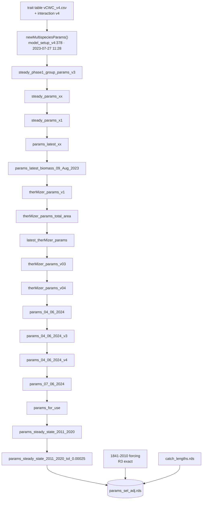

# Model construction assessment: from raw climate and fishing data to `params_sel_adj.rds`

Assessed 2026-10-05 on `Monte_Carlo_test_v2`, with R 4.6.0, mizer 3.1.0 and
therMizer 1.0.0. Read-only throughout: no notebook, script or stored object was
changed. The checks are scripts in `R/model_construction/`, listed in the
appendix, and every verdict below comes from one of them.

**Scope.** This covers the chain that produced `params_sel_adj.rds`, the base
of the September 2025 Monte Carlo on the VM. It starts from the raw ESM
forcing, catch and effort data, then runs through model construction, the
therMizer conversion and calibration. It stops at `params_sel_adj.rds`.

Three boundaries apply:
- **The bridge to p86.** The path from `params_sel_adj` to
  `params_ref_p86_agemat.rds` (phases 30-86, where the manuscript repo's `00a`
  starts) is mapped by object lineage only (§7).
- **Missing inputs.** Inputs absent from this disk and from git history are
  recorded as missing. The VM backup was not consulted.
- **Replays.** They ran under the installed mizer 3.1.0 only. Steps that used
  `tuneParams()` or an optimiser were classified, not replayed.

---

## 1. Summary

**The entry point.** `params_sel_adj.rds` (saved 2025-09-07 16:31, mizer 2.5.0;
md5 `88e6f9b2…`) is built in `09_Uncertainty_Analysis.Rmd:1104-1444`, not in
notebooks 00-08. Its save line, `:1477`, is commented out. The step takes the
calibrated `params_steady_state_2011_2020_tol_0.00025.RDS` and:
1. installs the 1841-2010 temperature and plankton forcing with
   `upgradeTherParams()`;
2. fits whale sigmoid selectivity from `IWC_data/catch_lengths.rds`;
3. calls `steady(tol = 0.002, t_max = 1000, preserve = "erepro")`.

**It is exactly reproducible from its stored inputs.** Replayed under mizer
3.1.0, every gear, forcing and rate-function slot is identical. `initial_n` and
biomass are identical; `R_max` agrees to 1e-15 (R6).

Everything between the annual forcing files and that step also regenerates
bit-for-bit:
- the 1841-2010 temperature and plankton arrays;
- the four spin-up arrays;
- the 1841-2010 effort array;
- the three interpolated temperature realms (R2-R4).

**Upstream of the calibrated parent, nothing re-runs as a script.** mizer stamps
every object, and all 69 saved 19-group `MizerParams` share one `time_created`,
2023-07-27 11:28: a single `newMultispeciesParams()` call. Their slot-by-slot
differences confirm a spine of 18 stored objects (§2).

The path along that spine passes through:
- **interactive edits.** 54 live `tuneParams()` calls sit in the on-spine
  notebooks, 28 of them in `model_setup_v4`. Seven spine steps change parameters
  (`h`, `gamma`, `kappa`) that no scripted call on the path changes.
- **objects overwritten in place or saved from arrays that no longer exist.**
- **mizer 2.4.0 and 2.5.0,** whose `matchBiomasses()` semantics differ from 3.1.0.
- **notebooks run out of order.** Numbering does not follow the lineage:
  - two on-spine notebooks live in folders named "old";
  - `03`'s model belongs to a superseded 16-group model;
  - `06` reads, at `:35`, an object it writes about 2,760 lines later.

The saved objects are the record, and the lineage now ties each one to its
script and lines.

**Methods text that needs correcting** (§6; ranked by consequence):
1. **The thermal-tolerance table (§S6.3) is wrong for nine groups.**
   - The model uses `temp_min` −1.5 °C for flying birds, small divers, squids,
     large divers and the four whale groups, and −2 °C for shelf and coastal
     fishes. These were set by hand at
     `05_therMizer_calibration_scale_model_domain.Rmd:500-519`.
   - The table shows the AquaMaps values from before that edit (e.g. 0.2-0.3 °C
     for whales).
   - At model temperatures (−1.19 to −0.47 °C), those values would place every
     whale group below its tolerance, which zeroes its rates.
2. **Temperature acts on metabolism through a different function from the one
   described.**
   - Encounter and predation use the thermal-performance curve U(T), as the
     text says.
   - Metabolic cost uses an Arrhenius term (0.63 eV) normalised to 0 at
     `temp_min` and 1 at `temp_max`.
   - At 1961 temperatures, metabolic cost runs at 1.6-33% of its base value,
     and encounter at 10-76% of its optimum.
3. **The Monte Carlo on the VM used a different observed catch from the rest of
   the pipeline.**
   - `yield_observed_timeseries_tidy.RDS`, read at `09:1174` and in the yield
     metrics, is Reported + Discards: it excludes IUU.
   - `yield_observed_timeseries.csv`, used from phase 44 on, by the manuscript
     refit and in §S7.1, is Reported + IUU + Discards.
   - IUU is 43.5% of shelf and coastal fish catch.
4. **The ×12.001 mol→g conversion in §S6.4 is never applied in `02`**
   (`02:115-116`). It has no effect on the final model, because the forcing
   enters as an anomaly and a constant factor cancels exactly (R1).
5. **Smaller items:**
   - The resource is initialised at the 1961-2010 forcing mean, not the
     2000-2010 mean.
   - Plankton forcing lags temperature by one year.
   - `tob` is used but not listed among the variables.
   - The reported median temperature (−0.93 °C) does not reproduce.
   - The "histsoc effort exists before 1950" caveat is numerically empty for
     Prydz Bay.
   - Non-whale selectivity is knife-edge at `w_mat`.
   - Steady states are solved under the first two forcing years only.

**Recommendation.** A "model construction" package for the manuscript repo
should run the deterministic last mile: forcing, effort and catch products, the
MC base, and the interaction matrix. All five are verified exact here (§5). It
should add one check script that verifies the stored lineage. It should document,
not run, the interactive 2023-2025 calibration. Design and open decisions are in
§8.

---

## 2. The lineage

### 2.1 How it was established

- **Ordering by stamps.** `A1_lineage.R` reads the stored slots of all 81 saved
  `MizerParams` (69 on the 19-group grid), unmodified, through `attributes()`.
  It orders them by mizer's `time_created`/`time_modified` stamps.
- **Choosing parents.** For each object, the parent is the latest earlier object
  with the fewest differing fields.
- **Explaining edges.** Every parent → child edge was diffed field by field, and
  each diff was matched to the code that produced it.

Verdicts:
- **confirmed**: every change is explained by the cited lines;
- **plausible**: the cited code explains the edge, but some change needs an
  interactive or unrecorded step.

### 2.2 The spine (18 stored objects)

| # | object (saved) | written by | what the stored diff shows | kind | verdict |
|---|---|---|---|---|---|
| 0 | `steady_phase1_group_params_v3` (2023-07-27 13:47; created 11:28) | `optim_model_setup_old/model_setup_v4.Rmd`: table and overrides `:102-322`; `newMultispeciesParams(kappa = 2.63907e13, w_pp_cutoff = 100)` `:378`; baleen box kernel `:481-485`; `w_mat ← 0.9 w_max` `:504-511`; `R_max` guess `:548`; orca↔large divers 0.6 `:776-783`; baleen ppmr `:816-817`; save `:846` (commented) | Built from the v4 table and the v4 interaction matrix (R7). Six `tuneParams()` sessions (`:633-832`) and two `calibrateBiomass()` calls before the save | scripted build, then interactive | construction confirmed; tuning interactive |
| 1 | `steady_params_xx` (07-28 17:44) | `model_setup_v4.Rmd:1141-1410` | `h` 14 spp, `gamma` 16, `erepro`/`R_max` all, length-weight `a` 16/`b` 9, `q`, `m`, large-diver target 0.022→0.011 g m⁻², catchability 4 | interactive | plausible |
| 2 | `steady_params_x1` (07-28 17:53) | `:1410-1423` | orca `h`/`gamma`/`q`, `R_max`, 2 catchabilities | interactive | plausible |
| 3 | `params_latest_xx` (07-29) | `:1423-1617` | small-diver `w_mat` 4266.667→4267, `h`, `gamma`, `m`; orca; 6 catchabilities | interactive | plausible |
| 4 | `params_latest_biomass_09_Aug_2023` | `04_therMizer_calibration_scale_g_m2.Rmd:396-617` | targets for 4 groups = `04:403-425` (McCormack et al. 2020; the meso/macrozooplankton swap is a documented correction, `04:401`); yield targets; `R_max` | scripted | confirmed |
| 5 | `therMizer_params_v1` (08-09) | `04:702-756` | only `temp_min`/`temp_max` added (the AquaMaps values); nothing else differs | scripted | confirmed |
| 6 | `therMizer_params_total_area` (08-16) | `05:53-79` | targets × exactly 1.474341e12 (the domain). Model abundance rescaled × 1.4797545e12 (`kappa`, resource, 1/`gamma`) by the `steady()` + `tuneParams()` total-biomass rescale, i.e. the area plus a 0.37% fit residual; `erepro` −1.9% to +4.6% | scripted + interactive | confirmed |
| 7 | `latest_therMizer_params` (08-16) | `05:235-574` | therMizer installed with aerobic and metabolic effects (`05:465-469`, `550-554`), the per-species depth-residence table (`05:302-460`), the absolute ESM plankton (`05:235-264`) and resource initialised at the 2000-2010 mean (`05:272-284`); **`temp_min` lowered for 9 groups (`05:500-547`)**; ladder `05:559-566` | scripted + interactive | confirmed |
| 8 | `therMizer_params_v03` (08-17) | `05:592-594`, "Manually tuned growth in tuneParams()" | `h` 5, `gamma` 18, baleen `m` | interactive | confirmed |
| 9 | `therMizer_params_v04` (08-17) | `05:641-679` | `setBevertonHolt()` with a hand-set reproduction-level vector: only `erepro`, `R_max` | scripted | confirmed |
| 10 | `params_04_06_2024` (2024-06-04; mizer 2.5.0) | `08_ISIMIP3a_simulations_Prydz_Bay.Rmd:389-542` | one gear per species (`08:404`); catchabilities from the ratio tuning and overrides `08:451-501` (krill 0.005, squids 5e-6, orca 0.1, sperm 1, …); `erepro` 0.999999 for 3 groups (`08:526-542`). Rate functions reverted to mizer's and the resource set to semichemostat, which 08's text does not do | scripted + unexplained | plausible (parent v03 or v04, indistinguishable) |
| 11 | `params_04_06_2024_v3` | `08:434-521` | `steady()` loop: leopard seal / minke / sperm `erepro` 0.999999 → 1.10 / 1.13 / **171.7** (inadmissible; repaired later); `R_max` | scripted | plausible |
| 12 | `params_04_06_2024_v4` | `model_setup_old/New_steady_state.Rmd:21-41` | `tuneParams()` ×2: `h` 12, `gamma` ×0.59 to ×56 (median ×24), **`kappa` −94%** (×0.057), `erepro`, `R_max` | interactive | confirmed |
| 13 | `params_07_06_2024` (06-07) | `model_setup_old/New_steady_state_07_06_2024.Rmd`: `erepro` cap 0.99 `:44`; `calibrateBiomass()`/`matchBiomasses()` ladders `:52-285`, interleaved with the **minke box kernel** `:179-181` and ppmr 1e5–5e6 for both whale groups `:263-267`; reloaded, `tuneParams()` and **overwritten under the same name** `:301-305` | `gamma` × 0.9948 uniform (the `calibrateBiomass()` rescale); minke switched to a box kernel; baleen ppmr 5.4e5–9.3e13 → 1e5–5e6. The `tuneParams()` session before the overwrite left no other visible change | scripted | confirmed |
| 14 | `params_for_use` (2024-08-26) | `06_steady_state_therMizer.Rmd:2742-2796` (save commented) | effort = 1951-1960 means, exactly the values hard-coded at `06:421-440`; plankton forcing = the `06:1065-1091` anomaly on `params_07_06_2024`'s resource level (exact on all 103 finite cells), rows 1961-62; temperature rows 1961-62 (exact); depth residence reset to equal 0.2; **therMizer encounter/predation installed, which needs `aerobic_effect = TRUE`; the active call `06:2782` says FALSE** | scripted | confirmed except the aerobic flag; the arrays saved that day (`*_26_08_2024.RDS`) are gone |
| 15 | `params_steady_state_2011_2020` (2025-03-13) | `06:143-191` | effort → 0 (`06:145`), yield targets → 0 (`06:152`), ladder, `tuneParams()` ×2 (`06:173`, `189`): `h` 2, `gamma` 14 (baleen ×24), minke `m`. One of the 14 `gamma` changes is hand-set: mesozooplankton ×2 at `06:184` | interactive | confirmed |
| 16 | `params_steady_state_2011_2020_tol_0.00025` (2025-03-19) | `06:237-312` | ladder tol 0.1 → 0.00025: only `initial_n`, `erepro`, `R_max` | scripted (mizer 2.5.0) | confirmed |
| 17 | **`params_sel_adj`** (2025-09-07 16:31) | `09_Uncertainty_Analysis.Rmd:1104-1444` | 1841-2010 forcing; whale `sigmoid_length` selectivity; `steady()` | scripted | **confirmed by exact replay (R6)** |

**Off-spine objects** (branch point in brackets):
- `params_fk`, `params_fk_mu`, `params_fk_v2` [3]: the prey-kernel branch,
  `04:181-435`.
- `therMizer_params_v02` [6].
- `therMizer_params_total_area_v2` [6]: 2024-03-12; its `gamma`, `h` and
  `temp_min` disagree with the spine.
- `params_04_06_2024_v2` [10].
- `tuned_params_05_06_2024` [12].
- `working_version_params_12_02_2025` [14].
- `params_steady_state_yield_1961_1980(_prelim)` [16]: `06:1779-2073`.
- `params_optimal_*` [16].
- `biomass_hybrid…`, `joint_hybrid…`, `params_best_tunable` [17]: post-MC
  products.
- The 15/16-group objects of February-April 2023, which share no stamp with the
  spine: `params_16_March_2023`, `params_optim_v0*`, `base_params`.

### 2.3 Data products feeding the spine

| product | built by | enters at |
|---|---|---|
| plankton spectra `GFDL_resource_spectra_annual.dat` | `02:72-458` (raw → annual log-log fit) | absolute: edge 7 (2023). As the anomaly of `06:1086-1088`: edges 14 and 17 |
| annual temperature `tos/t500m/t1000m/t1500m/tob_annual.rds` | `02:733-792` (no save line survives) | edge 7; edges 14, 17 via `06:887-1006` |
| `temperature_forcing_1841_2010.rds`, `phytoplankton_forcing_1841_2010.rds`, `constant_array_*` | `06:887-1260` (saves commented) | edge 17 |
| `effort_array.csv` → `effort_array_1841_2010.rds` | FishMIP `01:464-505` + IWC `03:156-164` → `04:764-839` → `06:48-80`, `491-518` | used by the MC projections (`params_sel_adj` carries zero effort) |
| observed catch `yield_observed_timeseries.csv` (R + IUU + D) | `01:42-391` | targets on several edges; phase 44 on; manuscript refit |
| observed catch `yield_observed_timeseries_tidy.RDS` (R + D) | `01:325` → `06:711-744` (from the never-committed `catch_timeseries.csv`) | the VM MC's yield metrics |
| `IWC_data/catch_lengths.rds` | **no producer found** | edge 17 |
| trait table `trait_groups_params_vCWC_v4.csv` | `group params/1g_simplified_groups_params.Rmd:585` (commented) | edge 0 |
| interaction `trait_groups_interaction_matrix_vCWC_v4.rds` | `interaction matrix/2g_trait_groups_interaction_matrix_vCWC.R:40-161` (R7 exact) | edge 0 |

### 2.4 One method fact the lineage exposes: which forcing years `steady()` sees

In mizer 3.1.0, `projectToSteady()` restarts every 1.5-year chunk at `t = 0`
(`project_simple(…, t = 0, …)`). therMizer then maps `t` onto forcing rows:
`t %% last_year + first_year`, then the latest row at or before it (in
`scaled_temp_effect`, `plankton_forcing` and `therMizerEReproAndGrowth`).

So every therMizer `steady()` solve sees only the first two forcing rows: about
two-thirds of each chunk in row 1, one-third in row 2.
- **The 2025 calibration** (edges 15-16) ran on `params_for_use`'s two-row
  arrays, i.e. 1961 and 1962 climate.
- **For `params_sel_adj`**, those rows are model years 1841-1842, which equal
  climate 1961-1962 under the six-cycle repeat.
- **Plankton.** Both rows carry ESM-1961 plankton, because of the one-year lag
  (§6, item 15).

The mizer 2.5.0 source was not inspected. The exact replay of edge 17 (a 2.5.0
`steady()` reproduced bit-for-bit under 3.1.0) is consistent with identical
behaviour.

---

## 3. Per-notebook verdict

Live counts are from `A2_inventory.R` (`inventory_summary.csv`).

| notebook | on spine? | contributes | live `tuneParams()` / optimiser | saves live / commented | notes |
|---|---|---|---|---|---|
| `00_Tidying IWC Southern Hemisphere data.Rmd` | data prep | IWC individual catches → model-domain clip (`:187-193`) → mass from length (`:343-447`) → CPUE series | 0 / 0 | 0 / 8 | raw `IWC data/*.csv` missing; outputs survive only in git history |
| `01_FishMIP_Fishing_Data.Rmd` | data prep | observed catch (FishMIP + IWC) → `yield_observed_timeseries.csv`; FishMIP effort normalised | 0 / 0 | 0 / 8 | `:43` reads a missing full-region effort file; the Prydz subset is tracked |
| `02_Preparing_Climate_Forcings.Rmd` | data prep | plankton spectra; annual temperature and interpolated realms | 0 / 0 | 5 / 6 | `:610-612` read a folder that does not exist; `:144`, `:207` case mismatch; `:382` reads a file since moved to `params/`; `:115-116` conversion unapplied; the annual saves are absent |
| `03_model_setup_pre_therMizer.rmd` | **model off spine** (16-group); IWC effort `:156-164` on spine | `IWC_effort.csv` (missing) | 9 / 5 | 5 / 7 | only its data-prep chunk matters here |
| `04_therMizer_calibration_scale_g_m2.Rmd` | edges 4-5; effort assembly | McCormack targets `:403-425`; AquaMaps tolerances `:702-750`; `effort_array.csv` `:764-839` | 4 / 0 | 3 / 8 | the `fk` prey-kernel branch is off spine |
| `05_therMizer_calibration_scale_model_domain.Rmd` | edges 6-9 | domain scaling; first therMizer install; **`temp_min` edits `:500-519`**; reproduction levels | 4 / 0 | 0 / 5 | |
| `06_steady_state_therMizer.Rmd` | edges 14-16; all 1841-2010 forcing; effort array; tidy catch | see §2 | 7 / 0 | 1 / **27** | run out of order: `:35` reads what `:2796` saves |
| `07_Calibrate_New_Reference_Period_pre_1961.Rmd` | off spine | optimiser on yield, from `therMizer_params_v04` | 1 / 0 | 0 / 1 | writes no params object |
| `08_ISIMIP3a_simulations_Prydz_Bay.Rmd` | edges 10-11 | gear split; catchability tuning; `erepro` cap | 0 / 0 | 6 / 6 | `:53` now reads the later `params_07_06_2024` |
| `09_Uncertainty_Analysis.Rmd` | edge 17 (`:1077-1477`) | the MC base; then the MC itself (beyond this boundary) | 0 / 9 | 51 / 20 | |
| `optim_model_setup_old/model_setup_v4.Rmd` | edges 0-3 | the construction | **28** / 1 | 0 / 15 | the `w_min` repair at `:524-525` was abandoned (`docs/size_parameter_audit.md`) |
| `model_setup_old/New_steady_state.Rmd` | edge 12 | `tuneParams()` | 10 / 0 | 0 / 1 | |
| `model_setup_old/New_steady_state_07_06_2024.Rmd` | edge 13 | ladder; minke box kernel and whale ppmr window (`:179-181`, `:263-267`); overwrite in place | 1 / 0 | 0 / 1 | |
| `group params/1g_simplified_groups_params.Rmd` | input to edge 0 | trait table | 0 / 0 | 0 / 3 | reads absolute paths on another machine (`C:/Users/kjmurphy/OneDrive - University of Tasmania/…`) |
| `interaction matrix/2g_trait_groups_interaction_matrix_vCWC.R` | input to edge 0 | interaction matrix | 0 / 0 | 1 / 4 | deterministic (its `set.seed` is for a plot palette); R7 exact |

At least fourteen packages the notebooks use are not installed here. Thirteen
are loaded with `library()`: mizerExperimental (`tuneParams()`,
`plotYieldVsSize()`), mizerHowTo, mizerMR, solong, SOmap, openair,
optimParallel, DEoptim, janitor, tictoc, Polychrome, magick and corrplot. The
fourteenth, abind, is called as `abind::abind` at `06:909`. The replays use
base-R equivalents, e.g. `cbind` for `abind(…, along = 2)`.

---

## 4. Input audit

`input_audit.csv` lists md5 and git status for every row below.

**Raw, external inputs**

| input | used by | state | md5 | git |
|---|---|---|---|---|
| GFDL-MOM6-COBALT2 obsclim `phydiat`, `phypico`, `phydiaz`, `zmicro`, `zmeso` (15′, monthly 1961-2010, 4,191 cells; 215 MB) | `02:72-318` | present | `e7c3ad9c…`, `865d3f11…`, `681007eb…`, `5ae110b1…`, `029ae357…` | ignored (`FishMIP_Plankton_Forcing/`) |
| `tos` monthly | `02:610` | present but **misfiled** in `FishMIP_Plankton_Forcing/` | `132736c6…` | ignored |
| `tob` monthly | `02:612` | **missing** | — | never in git |
| FishMIP histsoc catch, regional | `01:42` | present (12.8 MB) | `5501b0aa…` | tracked |
| FishMIP histsoc effort, full regional | `01:43` | **missing** | — | never in git |
| FishMIP histsoc effort, Prydz subset | R4b | present | `50ff6cc8…` | tracked |
| IWC individual catches `SHP1`, `SHP2`, `SHL`, `SU` | `00:46-55` | **missing** | — | never in git |
| model-domain polygon `model_domains/Stacey/BanzareBank.rds` (1.47e12 m²) | `00:187` | present | `7130f275…` | tracked |
| `IWC_data/catch_lengths.rds` (355 rows: species, catch, length) | `09:1329` | present, **no producer**, untracked | `d9921024…` | ignored |
| species tables `csvs/{predator,fish,squid}_parameters_updated.csv` | `1g` | present | `8950ee08…`, `566179c1…`, `7f489871…` | tracked |

Sources are FishMIP/ISIMIP3a (GFDL forcing, histsoc catch and effort), the IWC
individual-catch database, McCormack et al. 2020 (biomass targets, hard-coded at
`04:403-425`) and AquaMaps (tolerances, hard-coded at `04:702-750`).

**No licence is recorded anywhere in the repo.** The IWC-derived files
(`catch_lengths.rds` and the CPUE series) are individual-record products. Their
redistribution terms must be checked before any of them is published.

**Frozen intermediates**

| file | md5 | producer | replay |
|---|---|---|---|
| `tos/t500m/t1000m/t1500m/tob_annual.rds` | `fe6eb084…`, `b0346f5e…`, `018b6d4d…`, `69278852…`, `f834e76e…` | `02:733-792`; no save line survives | `tos` and the three interpolated realms exact (R2); `tob` cannot be rebuilt |
| `GFDL_resource_spectra_annual.dat` | `1df9ba74…` | `02:434-458`, which writes another name at `:576` | **not reproduced** (R1) |
| `effort_array.csv` | `82922586…` | `04:839`, commented | rebuilds to 0.2% (R4b) |
| `yield_observed_timeseries.csv` | `e48df259…` (= manuscript `data/`) | `01:391`, commented | to 4e-6, 6 significant digits (R5) |
| `yield_observed_timeseries_tidy.RDS` | `1c7ccb81…` | `06:744`, commented | = Reported + Discards (R5) |
| IWC CPUE `catch_timeseries_BanzareBank_1930_2019_CPUE.rds` and three siblings | `b92bf815…` (history copy) | `00:521-522` | in history only: added `f54387b` 2023-04-21, removed `eff162e` 2023-09-27 |
| `catch_timeseries.csv`, `IWC_effort.csv`, `effort_Prydz_Bay_1950_2010_resolution_v1.RDS`, `*_26_08_2024.RDS` | — | `01:325`, `03:164`, `01:505`, `06:84-85`/`1091` | **missing**, never committed |
| trait table `vCWC_v4.csv` | `4749f46b…` | `1g:585`, commented | inputs checked (R7) |
| interaction `vCWC_v4.rds` | `805f23c6…` | `2g:161`, commented | **exact** (R7) |

**Products that regenerate exactly:** `temperature_forcing_1841_2010.rds`
(`94d60f87…`), `phytoplankton_forcing_1841_2010.rds` (`32130254…`), the four
`constant_array_*`, and `effort_array_1841_2010.rds` (`f8f7f94c…`, equal to the
manuscript repo's `data/` copy).

**The 18 spine objects** total 2.65 MB, and every one is tracked.
`params_sel_adj.rds` (`88e6f9b2…`) is byte-identical in three places: the root,
`Manuscript data/`, and the manuscript repo's `ensemble/inputs/mc_origin/`.

---

## 5. Replay results

| replay | what | result |
|---|---|---|
| **R1** | `02` plankton spectra from the five raw CSVs | **FAIL** on the stored `.dat`. The stored rows are exact lines in log10 *w* but sit +1.17 log10 above the rebuild in intercept, with slopes higher by 0.0006-0.0013. With the documented ×12.001 applied, the residual falls to 0.103. The 1961-2010 **anomaly agrees to 0.0068 log10**. PASS: cells align across files (`02` borrows the diatom areas by position); ×12.001 is an exact constant shift that cancels in the anomaly. Likely cause: the `.dat` was made by an earlier `02` that applied ×12.001, possibly from a different extraction. **No effect on the final model** (§2.3) |
| **R2** | `tos_annual` from the monthly CSV; the three interpolated realms | PASS, max relative difference 0 |
| **R3** | 1841-2010 temperature and plankton forcing, spin-up arrays, the anomaly on `params_new_v4` | PASS, all 13 checks, bit-for-bit. Checks include the six-cycle repeat (both arrays), the one-year plankton lag, and that `params_sel_adj` carries both arrays unchanged |
| **R4** | (a) `effort_array.csv` → `effort_array_1841_2010.rds`; (b) `effort_array.csv` from the FishMIP subset and the IWC CPUE in history | (a) PASS, identical; every gear peaks at exactly 1; zero before 1930. (b) **FAIL**, but close: same 260 cells; whales agree to ~5e-7, FishMIP groups to ≤ 0.22% (toothfishes), 0.08% (krill), 0.07% (shelf and coastal) |
| **R5** | `yield_observed_timeseries.csv` from `01`; the tidy series | CSV PASS to 4.0e-6 (the stored file holds 6 significant digits in Excel-style format, e.g. `3.35374E+11`). The coverage table of §S7.1 reproduces exactly. Tidy series **FAIL** by design: it is Reported + Discards (agreement 4.4e-10), not Reported + IUU + Discards. The suspected group-sum double count at `01:65` never fires: every (Year, Sector, SAUP, FGroup) group has one row |
| **R6** | **`params_sel_adj` from its parent** | **PASS, all 13 checks**: gear (`sel_func`, `l50`, `l25`, catchability, knife edge), the five forcing slots, rate functions and selectivity are identical. `steady()` converged in 3 years; `initial_n` and biomass identical, `R_max` 9.7e-16, `erepro` preserved |
| **R7** | interaction matrix from `2g`; construction inputs | `2g` reproduces the stored v4 matrix exactly. The built model differs from it only by the scripted orca↔large-diver edit (`model_setup_v4:776-783`), and `params_sel_adj` carries the built matrix unchanged. The table plus overrides matches the first object except the known clamps and fixes, rounding, and leopard-seal β (table 11.236, script `:651` sets 1000, object has 100: an unrecorded edit) |

---

## 6. Methods cross-check

Against `docs/manuscript_methods_supplement.md` (§S1, S2, S6-S8) and
`docs/manuscript_methods_main_text.md` §2.2.

| # | claim | evidence | verdict and suggested change |
|---|---|---|---|
| 1 | §S1 domain 1,474,341 km² (`05:45-58`) | polygon area 1.47e12 m²; targets × exactly 1.474341e12 | **correct** |
| 2 | §S7.1 "clipped … to the BANZARE Bank polygon within the model domain" | `00:187` reads the *model-domain* polygon `BanzareBank.rds` | **imprecise**: it is the domain polygon itself |
| 3 | §S2 100 bins, 3.162e-8 to 1.03e8 g, 15.51 decades; 142 resource classes | `params_sel_adj` | **correct** |
| 4 | §S6.1 GFDL obsclim, 15′, 1961-2010, 4,191 cells, area-weighted sums | R1, R2 | **correct for plankton**. The table omits **`tob`**, which is used. Temperature is an **unweighted** cell mean (`02:723`); area weighting would be 0.02-0.05 °C warmer |
| 5 | §S6.2 six-fold repeat of 1961-1980 (`06:918-979`) | R3, bit-for-bit, both arrays | **correct** (built from obsclim, as the existing note says) |
| 6 | §S6.3 U(T) rescales encounter, predation **and** growth/reproduction energy | therMizer 1.0.0 source | **partly wrong**: metabolic cost uses a normalised Arrhenius term (0 at `temp_min`, 1 at `temp_max`), not U(T). At 1961 temperatures it scales metabolism to 0.016-0.33 and encounter to 0.10-0.76 |
| 7 | §S6.3 tolerance table (AquaMaps) | the object; `05:500-519` | **wrong for 9 groups**: `temp_min` is −1.5 (flying birds, small divers, squids, large divers, minke, orca, sperm, baleen) and −2 (shelf and coastal). Report the values used and that they were set to keep the domain's temperatures inside each range |
| 8 | §S6.3 equal residence across five realms | `vertical_migration` all 0.2 | **correct for the final model**. The per-species table *was* used from 2023-08 to 2024-06 (`05:302-469`, carried to `params_07_06_2024`) and dropped at `params_for_use` |
| 9 | §S6.3 realised temperatures: median −0.93 °C, range −1.19 to −0.47 | the five realms 1961-2010 | **median does not reproduce** (−0.731 over all realms; `tos` alone −0.946); range **correct** |
| 10 | §S6.4 × 12.001 then × 10 | `02:115-116` | **wrong as coded**: only × 10 is applied. **Inconsequential**: the anomaly cancels any constant factor exactly (R1) |
| 11 | §S6.4 size classes, midpoints, annual log-log fit across 142 classes | `02:49-57`, `330-333`, `434-458` | **correct** |
| 12 | §S6.4 anomaly added to the calibrated resource level (`06:1085-1089`) | R3 | **correct**. Add: forcing year *Y* carries ESM year *Y−1* (plankton lags temperature by one year; ESM 2010 is never used). The calibrated level itself is the June-2024 semichemostat resource (`kappa` hand-tuned, edge 12) plus the ESM-1961 anomaly (0.009-0.023 log10) |
| 13 | §S6.4 "initialised at the 2000-2010 mean of the forced spectrum" | the object | **imprecise**: the initial resource equals the **1961-2010** forcing mean by construction (0.1%), versus 2.3% for the 2000-2010 mean. The 2000-2010 initialisation (`05:272-284`) belongs to the 2023 branch |
| 14 | §S6.4 `kappa`, `lambda`, `r_pp` do not govern projections | `plankton_forcing` | **correct**. Note: `kappa` did set the resource level the model was calibrated to |
| 15 | §S7.1 catch = reported + IUU + discards; coverage table | R5 | **correct for the CSV**; table exact. **Missing**: the VM MC's yield metrics used Reported + Discards (`yield_observed_timeseries_tidy.RDS`) |
| 16 | §S7.1 IWC processing and length-weight coefficients | `00:145-193`, `343-447` | **correct by code reading**; not replayable (raw IWC missing) |
| 17 | §S7.2 effort normalised to each group's maximum; zero-filled from 1841; one gear per group | R4 | **correct** |
| 18 | §S7.2 "histsoc effort exists for 1841-1949 in the regional product" | R4: Prydz histsoc effort before 1950 is ≤ 2.2e-16 per year | **misleading**: it is numerically zero (and `01:484` drops < 1e-15), so starting effort in 1930 loses nothing from FishMIP |
| 19 | §S7.2 whale `l50` = catch-weighted 60th percentile, `l25` just below | R6 | **correct** (`l25` = `l50` − 2%). Add: the model converts length to mass with its own `a`, `b`, which differ from `00`'s for orca (×1.62 at `l50`), baleen (×1.10) and sperm (×0.88) |
| 20 | §S7.2 other groups "from the size at which each group enters the fishery (§S13)" | `gear_params` | **fill §S13**: knife-edge at `w_mat` for every fished non-whale group |
| 21 | §S7.3 "catchability is not fitted in the reference model" | edge 10 | **true of p100**. The pre-MC base carried ratio- and hand-tuned `q` (krill 0.005 … sperm 1), which centred the MC's draws |
| 22 | §S8 targets (`04:403-425`) | the object | **correct**: `params_sel_adj` targets = the list × 1.474341e12 exactly |
| 23 | §S8 calibration procedure | §2 | **correct for p100, silent on origins**. Suggest one sentence: the reference descends from a model tuned interactively (mizer `tuneParams()`) in 2023-2025. Every steady state is solved under the first two forcing years (1961-1962 climate) |
| 24 | main text §2.2 | all of the above | **correct** except: "sea-surface temperature" should include bottom temperature, and the thermal wording should be adjusted as in item 6 |

---

## 7. The 30 → 86 bridge (object lineage only)

This path is mapped by stamps and producer scripts only; there are no slot-diff
verdicts. It is the gap between `params_sel_adj` and the manuscript repo's `00a`
input.

| object | producer | parent (nearest stored) |
|---|---|---|
| `params_sel_adj_wmin_corrected` | `R/wmin_test/30_stageC_corrected_params.R:229` | `params_sel_adj` |
| `params_sel_adj_wmin_corrected_biocal` | `42_recalibrate_base_biomass.R:327` | ↑ |
| `params_whale_lognormal_kernel(_theta05_asym)`, `…_bk05_mk05` | `51_whale_kernel_recalibrate.R:102` | ↑ |
| `params_ref_sw2000_balror_mnkfish05` | `54_reference_model_recalibrate.R:72` | ↑ |
| `params_ref_p57_subsidy_wcut1_erepro` | `57_offdomain_subsidy.R:344` | ↑ |
| `params_ref_p58_cap09`, `…_reladdered` | `58_cap_repro_then_free_erepro.R:57-58` | ↑ |
| `params_ref_p59_cap09_tol001` | `59_reladder_tighter_tolerance.R` | ↑ |
| `params_ref_p62_intres_balkrill075` | `62_interaction_resource_balkrill.R:69` | ↑ |
| `params_ref_p73_intmatrix` | `73_interaction_matrix_edits.R:48` | ↑ |
| `params_ref_p74_intmatrix` | `74_interaction_matrix_edits2.R:36` | ↑ |
| **`params_ref_p86_agemat`** | **no producer in the repo or its history** (committed `6f3f19d`, 2026-08-14) | `p74_intmatrix`: adds `age_mat`; per-species growth rescale (`h`, `ks`, `gamma`, i.e. `matchGrowth()` to realised `age_mat`); recalibration |

Branches off this path, none an ancestor of p86:
- `whres*` (phases 55/56);
- the other p57 arms;
- `p63`, `p66*`, `p73_recal_growth`, `p74_recal_growth`;
- `p75_recal_capped` and `p76_recal_rltargets`, which also have **no producer**.

The README's statement that phases 42-86 cannot be rebuilt from committed scripts
is therefore precise in one respect: the last step into p86 has no script.

---

## 8. Proposed package design (for decision)

**Principle.** As for `00a`-`00e`, the package encodes the scripted method and
verifies it against the stored objects. It never regenerates or overwrites them;
outputs go to `build/`.

**Runnable, each verified exact here:**

| script | from | inputs | output | check |
|---|---|---|---|---|
| interaction matrix | `2g:40-156` | `trait_groups_params_distributions_vCWC_v4.rds` | v4 matrix | identical (R7) |
| forcing 1841-2010 | `02:789-792`, `06:887-1260` | the five annual temperature files, `GFDL_resource_spectra_annual.dat`, `params_steady_state_2011_2020_tol_0.00025.RDS` | both forcing arrays, four spin-up arrays | identical (R2, R3) |
| effort and catch | `06:48-80`, `491-518`; `01:42-391` | `effort_array.csv`; FishMIP catch + IWC CPUE series | `effort_array_1841_2010.rds`; `yield_observed_timeseries.csv` | identical; catch to 6 significant digits (R4a, R5) |
| MC base | `09:1104-1444` | parent, forcing, `catch_lengths.rds` | `params_sel_adj.rds` | identical (R6) |
| lineage check | `A1_lineage.R` | the 18 spine objects (2.65 MB) | edge table | every edge matches §2.2 |

**Documented, not run.** Notebooks 00-08 and `model_setup_v4`, `New_steady_state*`
and `1g` become a provenance section, with the §2.2 table citing dev paths and
lines. The 2023-2025 calibration is interactive and cannot be scripted.

**Conditional (decide).**
- **R1, the raw plankton extraction.** It could run with a skip when the 215 MB
  of raw CSVs is absent. It does not reproduce the stored file, so it documents
  more than it verifies.
- **R4b, the upstream effort rebuild.** Agreement is 0.2%, not exact.

**Open decisions for Kieran:**
1. **Placement.** One option is `scripts/000a…000v` (sorts before `00_`, inputs
   under `ensemble/inputs/construction/`). The other is a separate top-level
   `construction/` folder. *Recommended:* the `000` prefix, to keep one ordered
   `scripts/` folder.
2. **IWC-derived files** (`catch_lengths.rds`, the CPUE series). Redistribution
   terms must be checked before either is committed to the private repo.
3. **The 18 spine objects.** Ship them for the lineage check, or check only the
   edge from parent to `params_sel_adj`?
4. **The catch definitions.** How the manuscript should describe the two
   definitions (R + D for the VM MC, R + IUU + D afterwards).
5. **Methods corrections** (§6): which to apply to the manuscript text.

---

## 9. Observations, not acted on

1. **No raw input to the published model is versioned anywhere.**
   `IWC_data/` and `FishMIP_*` are gitignored; `tob`, the IWC raw CSVs and the
   full-region effort file are missing.
2. **`02` does not run as written:**
   - it reads a folder that does not exist (`:610-612`);
   - two file names differ in case (`:144`, `:207`);
   - it reads `params_latest_xx.rds` from the root, where the file no longer is
     (`:382`, whose comment also says "w_full is 164"; it is 142);
   - the annual temperature and spectra outputs have no surviving save line.
3. **Execution order is not reconstructible from the notebooks.**
   - `06` reads, at `:35`, what `:2796` saves, and has 27 commented saves;
   - `08:53` reads an object `08` itself preceded;
   - `params_07_06_2024` was overwritten under its own name after a
     `tuneParams()` session.
4. **The `aerobic_effect` flags are inert.** `aerobic_effect = FALSE` at
   `09:1110`, `06:1269` and `06:2785` installs nothing and removes nothing, so
   the final model keeps temperature-scaled encounter and predation. The code
   text misdescribes the object it produced.
5. **A latent double count in `01:65`.** A grouped
   `mutate(total = sum(...))` followed by a grouped `summarise(sum(...))` would
   count rows several times over if any group held more than one row. None does
   in this data.
6. **Six-significant-digit stored files.** `yield_observed_timeseries.csv` and
   (probably) `effort_array.csv` were saved through Excel, with values such as
   `3.35374E+11`.
7. **Large divers' knife edge** is 5.06e5 g = `w_max`/4: mizer's silently
   clamped `w_mat`, kept from 2023. The group is unfished, so this has no effect.
8. **Leopard-seal β = 100** comes from an unrecorded edit (table 11.236; script
   1000).
9. **Sperm-whale `erepro` reached 171.7** at `params_04_06_2024_v3` (edge 11),
   and was repaired later. This is historical.
10. **`group params/1g…` reads absolute paths** on another machine.
11. **The dev docs misframe the pipeline.** `README.md` still recommends the
    superseded 16-group `params_optim_v04_w_pp_100.rds`. `AGENTS.md` calls
    `00_`-`09_*.Rmd` "the original numbered pipeline", although two on-spine
    notebooks live elsewhere and `03`'s model is off spine.
12. **The calibrated resource level carries the ESM-1961 anomaly** (0.009-0.023
    log10), because the calibration ran under the 1961 forcing row. This is a
    small anchoring offset, not an error.

---

## Appendix: how this was checked

The scripts are in [`R/model_construction/`](../R/model_construction/).

**Locations.** Run them from the repository root, in the order below. They read
the repository and write only to `ASSESS_OUT`, which defaults to
`Output_large_files/model_construction/` (ignored by git). Three other
variables override locations:
- `ASSESS_REPO` (default `.`);
- `ASSESS_SRC` (default `R/model_construction`);
- `ASSESS_MS_REPO` (default `../Prydz_Bay_mizer_manuscript`, used only by `V`).

The R scripts run as `Rscript --vanilla R/model_construction/<script>`.

| order | script | runtime | output |
|---|---|---|---|
| 1 | `bash R/model_construction/A0_extract_history.sh` (Git Bash) | 1 s | `history/`: the IWC intermediates from git history (`f54387b`, `a2e58d2`) that R4 and R5 read |
| 2 | `A1_lineage.R` | 7 s | `objects.csv`, `parents.csv`, `lineage_edges.csv`, `species_param_changes.csv`, `gear_param_changes.csv`, `interaction_changes.csv`, `distance_fields.csv` |
| 3 | `A2_inventory.R` | 4 s | `inventory_lines.csv`, `inventory_summary.csv` |
| 4 | `pwsh -NoProfile -ExecutionPolicy Bypass -File R/model_construction/A3_input_audit.ps1` | 48 s | `input_audit.csv`; prints the missing-file, git-history and p86-producer searches |
| 5 | `R1_plankton.R`, `R1b_diagnose.R` | 45 s, 42 s | `R1_results.csv`, `R1b_results.csv` |
| 6 | `R2_temperature.R` … `R7_construction.R`, `W5_checks.R` | 1-12 s each | `R2`-`R7` and `W5` `_results.csv`; `R6_params_sel_adj_replay_mizer310.rds` |
| 7 | `A4_followups.R` | 3 s | prints the follow-up diagnostics behind §2.2, §2.4, §6 items 6-7 and 15, and §7 (needs A1's output) |
| 8 | `V_report_check.R` | 1 s | `V_results.csv`: every md5 and 98 cited line numbers re-read |

Runtimes were measured on 2026-10-05 from the repository copies. Every output
was byte-identical to the original scratchpad run, except R6's wall-time note
and the replay object's `time_modified` stamp.

**IWC data.** The files in `history/` derive from IWC individual-catch records.
Keep them out of git until their terms are checked. Nothing is restored into the
working tree.

The scripts are uncommitted. They are the candidates for the §8 package.
